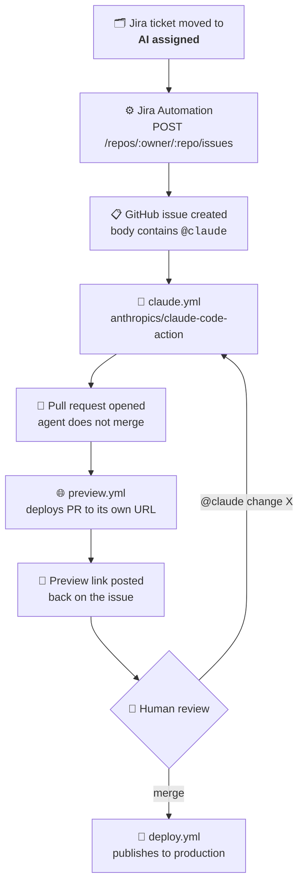

# agentic-prs

Jira tickets in, reviewed pull requests out — with an AI agent doing the implementation and
**zero API billing**.

Move a ticket into the `AI assigned` column on a Jira board and, without anyone touching a
keyboard, an agent reads the ticket, writes the code, opens a pull request, and deploys a live
preview of that PR to its own URL. A human reviews and merges; production updates itself.

**Live site:** https://gonz96.github.io/agentic-prs/

This repository is the working end of that pipeline: the GitHub Actions workflows, plus a small
static page that serves as the codebase the agent operates on.

## How it works

Jira never talks to the AI directly. It only creates a GitHub issue — everything else is
GitHub-native, which keeps the moving parts observable and debuggable.

## Workflows

| File | Trigger | Responsibility |
|---|---|---|
| [`claude.yml`](.github/workflows/claude.yml) | `@claude` in an issue, comment, or review | Agent implements the change and opens a PR |
| [`preview.yml`](.github/workflows/preview.yml) | PR opened / updated / closed | Deploys the PR to `gh-pages/pr-preview/pr-<N>/`, posts the link on the originating issue, tears it down on close |
| [`deploy.yml`](.github/workflows/deploy.yml) | Push to `main` | Publishes to the root of `gh-pages` → production |

Production and previews share a single `gh-pages` branch: production at the root, previews in
subdirectories. `deploy.yml` uses `clean-exclude: pr-preview/` so a production deploy never
wipes the previews living alongside it.

## Design decisions

**Subscription OAuth instead of an API key.** The action authenticates with
`CLAUDE_CODE_OAUTH_TOKEN`, generated via `claude setup-token` from a Claude Pro subscription,
rather than `ANTHROPIC_API_KEY`. Agent runs draw down the same quota as interactive use instead
of billing per token. This ruled out the official *Claude Agent for Jira* Marketplace app,
which requires a metered API key.

**The bridge goes through a GitHub issue, not `repository_dispatch`.** Dispatch would trigger
the workflow directly and skip creating an issue, which is cleaner on paper. The issue is worth
the extra object: it's where the agent streams its progress checklist, where the preview link
gets posted, and where a human replies `@claude do X instead` to iterate — all without leaving
GitHub. It becomes the agent's session panel.

**The agent never merges its own work.** `allowedTools` grants `gh pr create` but withholds
`gh pr merge`, and the repository's [`CLAUDE.md`](CLAUDE.md) states the constraint explicitly.
Every change passes through human review and a working preview URL before it can reach
production.

**Previews wait for the CDN.** `pr-preview-action` finishes as soon as it pushes to
`gh-pages`, but GitHub Pages needs another 30–60s to actually serve it. Announcing the URL at
that moment produces a link that 404s. Setting `wait-for-pages-deployment: true` and posting a
`🚧 deploying…` comment that is later *edited* to `✅ deployed` — rather than posting twice —
makes the notification truthful at every point.

## Problems worth documenting

**`401 Requires authentication` from the Jira web request.** Jira Automation's **Hidden**
checkbox on a header value can blank the field internally while still rendering `····` in the
UI. The token was valid; it simply wasn't being sent. Diagnosis relied on reading the status
code as a signal: `401` means no valid credential arrived at all, whereas a scope or repository
problem surfaces as `403`/`404`. That distinction pointed at the header rather than the token,
which is where the actual bug was.

**Smart values break JSON silently.** A Jira description containing quotes or newlines
corrupts a hand-built JSON payload. The fix is `{{issue.summary.asJsonString}}` — but that
function emits its *own* surrounding quotes, so wrapping it in quotes yourself produces
doubled delimiters and a `400`. The multi-line body is assembled once into a variable, then
serialized as a whole.

**Workflows added after a PR exists don't retroactively run on it.** A workflow only executes
for events that occur after it lands on the default branch. Validating a new workflow against
an already-open PR requires a fresh `synchronize` event — a new commit — not a re-run.

## Setup

1. Install the [Claude GitHub App](https://github.com/apps/claude) on the repository.
2. Run `claude setup-token` locally and store the result as the repository secret
   `CLAUDE_CODE_OAUTH_TOKEN`.
3. Enable GitHub Pages: *Deploy from a branch* → `gh-pages` / `(root)`.
4. Create a fine-grained GitHub PAT scoped to this repository with `Issues: read and write`.
5. In Jira, create an automation flow: trigger on transition to `AI assigned`, build the issue
   body in a variable, then `POST` it to `https://api.github.com/repos/<owner>/<repo>/issues`
   with an `Authorization: Bearer <PAT>` header.

## Scope

The static page here is deliberately trivial — the interesting artifact is the pipeline, not
the site. [`CLAUDE.md`](CLAUDE.md) constrains the agent to inline edits with no build step, so
tickets should be scoped accordingly.
