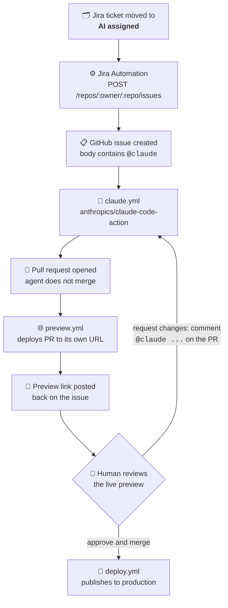

# agentic-prs

Jira tickets in, reviewed pull requests out — with an AI agent doing the implementation and
**zero API billing**.

Move a ticket into the `AI assigned` column on a Jira board and, without anyone touching a
keyboard, an agent reads the ticket, writes the code, opens a pull request, and deploys a live
preview of that PR to its own URL. A human reviews and merges; production updates itself.

**Live site:** https://gonz96.github.io/agentic-prs/

This repository is the working end of that pipeline: the GitHub Actions workflows, plus a small
static page that serves as the codebase the agent operates on.

## Who does what

Only two steps are manual, marked 👤 below. Everything else happens on its own.

```mermaid
flowchart LR
    subgraph JIRA["📋 JIRA"]
        A["👤 🗂️ Move ticket to<br/><b> "AI assigned" column</b>"]
    end

    subgraph GH["🐙 GITHUB"]
        B["🔀 PR opened with a<br/>live preview of the change"]
        C{"👤 Review the deployed<br/>web and PR"}
        D["🚀 Merge<br/>→ production"]
    end

    A --> B --> C
    C -->|"approve"| D
    C -->|"comment <b>@claude change...</b>"| B

    classDef manual fill:#deebff,stroke:#4c9aff,stroke-width:2px,color:#172b4d
    classDef auto fill:#e3fcef,stroke:#57d9a3,color:#172b4d
    class A,C manual
    class B,D auto
```

**👤 Manual — the Product Owner** drags a card into `AI assigned` in Jira, and never opens
GitHub.

**👤 Manual — the developer** opens the preview URL, sees the change already running, and
either approves it or replies `@claude change...` to send it back. They never open Jira.

> ⚠️ **Reply on the PR, not the issue.** The preview link gets posted on the originating
> issue, which makes it tempting to keep the conversation there — but the agent only resumes
> the existing branch when it's triggered from a comment **on the pull request itself** (or a
> PR review). Commenting `@claude` on the issue instead starts a brand-new branch from
> scratch, with no PR and no preview, leaving your original PR untouched.

Everything else — reading the ticket, writing the code, opening the PR, deploying the
preview, publishing to production — runs without anyone involved.

## How it works under the hood



Requesting changes doesn't open anything new — the agent pushes another commit to the same
branch, the preview URL updates in place, and the review starts again.

Jira never talks to the AI directly. It only creates a GitHub issue — everything else is
GitHub-native, which keeps the moving parts observable and debuggable.

## Workflows

| File | Trigger | Responsibility |
|---|---|---|
| [`claude.yml`](.github/workflows/claude.yml) | `@claude` in an issue, comment, or review | Agent implements the change and opens a PR |
| [`preview.yml`](.github/workflows/preview.yml) | PR opened / updated / closed | Deploys the PR to `gh-pages/pr-preview/pr-<N>/`, posts the link on the originating issue, tears it down on close |
| [`deploy.yml`](.github/workflows/deploy.yml) | Push to `main` | Publishes to the root of `gh-pages` → production |

Production and previews share a single `gh-pages` branch: production at the root, previews in
subdirectories. `deploy.yml` uses `clean-exclude: pr-preview/` so a production deploy never
wipes the previews living alongside it.

## Design decisions

**Subscription OAuth instead of an API key.** The action authenticates with
`CLAUDE_CODE_OAUTH_TOKEN`, generated via `claude setup-token` from a Claude Pro subscription,
rather than `ANTHROPIC_API_KEY`. Agent runs draw down the same quota as interactive use instead
of billing per token. This ruled out the official *Claude Agent for Jira* Marketplace app,
which requires a metered API key.

**The bridge goes through a GitHub issue, not `repository_dispatch`.** Dispatch would trigger
the workflow directly and skip creating an issue, which is cleaner on paper. The issue is worth
the extra object: it's where the agent streams its progress checklist, where the preview link
gets posted, and where a human replies `@claude do X instead` to iterate — all without leaving
GitHub. It becomes the agent's session panel.

**The agent never merges its own work.** `allowedTools` grants `gh pr create` but withholds
`gh pr merge`, and [`CLAUDE.md`](CLAUDE.md) — the brief the agent reads on every run — states
the constraint explicitly. Every change passes through human review and a working preview URL
before it can reach production.

**Previews wait for the CDN.** `pr-preview-action` finishes as soon as it pushes to
`gh-pages`, but GitHub Pages needs another 30–60s to actually serve it. Announcing the URL at
that moment produces a link that 404s. Setting `wait-for-pages-deployment: true` and posting a
`🚧 deploying…` comment that is later *edited* to `✅ deployed` — rather than posting twice —
makes the notification truthful at every point.

## Setup

1. Install the [Claude GitHub App](https://github.com/apps/claude) on the repository.
2. Run `claude setup-token` locally and store the result as the repository secret
   `CLAUDE_CODE_OAUTH_TOKEN`.
3. Enable GitHub Pages: *Deploy from a branch* → `gh-pages` / `(root)`.
4. Create a fine-grained GitHub PAT scoped to this repository with `Issues: read and write`.
5. In Jira, create an automation flow: trigger on transition to `AI assigned`, build the issue
   body in a variable, then `POST` it to `https://api.github.com/repos/<owner>/<repo>/issues`
   with an `Authorization: Bearer <PAT>` header, using the PAT created in step 4.

## Scope

The static page is a sandbox — deliberately trivial, so that the pipeline has something real to
change. The artifact worth looking at is the automation, not the site.
